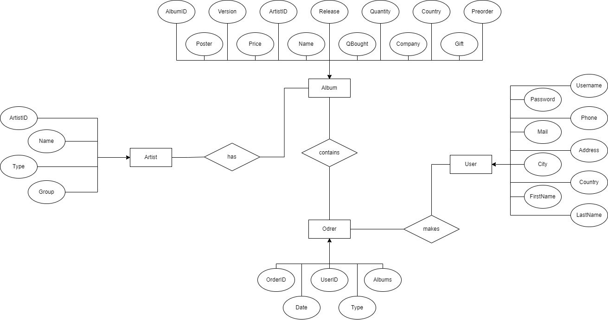

# K-STORE

## Идея
Необходимо реализовать БД, а также интерфейс для доступа к данным.

Приложение магазина в котором можно купить альбомы исполнителей. Также есть возможность заказать альбом которого нет в наличии.

## Предметная область
Предметная область - музыка.
Пользователями приложения могут являться все люди желающие купить альбом. Также, владелец магазина может посмотреть все заказы и состояние товаров. 

## Анализ аналогичных решений

| Название   | Возможность под-заказа | Возможность под-заказа определённой версии при наличии остальных  | Возможность пред-заказа с предзаказанными плюшками | 
|------------|-------------------------------------|-------------------------------------|------------------------------------|
| pop.rs | Нет | Нет | Да |
| candyshop.ru    | Да | Нет | Нет |

## Целесообразность и актуальность
Физические альбомы снова популярны, поэтому спрос на них растет. Однако часто бывает что определенных альбомов нет в наличии в магазинах, особенно если исполнитель не известный. Поэтому необходимо наличие магазина, который позволяет купить альбомы разных исполнителей и имеющегося возможность пред-заказа и под-заказа.

## Use-case диаграмма

## ER диаграмма сущностей

